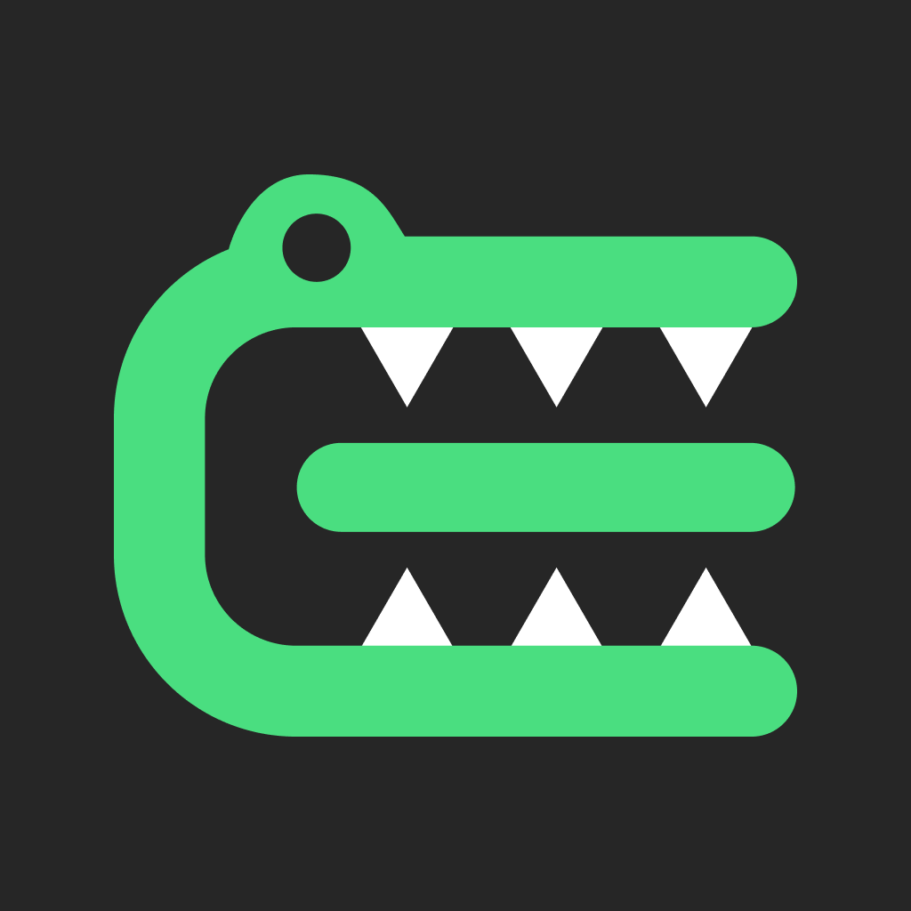
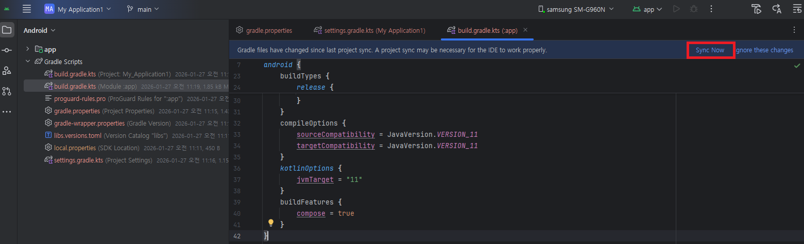

# Elegaiter SDK (Android) 연동 가이드

<p align="center">

</p>

### SDK 정보 요약
| 항목 | 내용 |
| :--- | :--- |
| **지원 플랫폼** | Android (Min SDK 24 이상 권장) |
| **개발 언어** | Kotlin (Coroutines 완벽 지원) |
| **배포 방식** | Maven Repository (클라우드 저장소) |
| **제공 형태** | AAR (Android Archive) |

### 요구 사항 (Requirements)
* **Android Studio:** 최신 버전 권장
* **Kotlin:** 1.8 이상 권장
* **Android Minimum SDK:** API 24 (Android 7.0) 이상
* **인증 키:** API Key (주식회사 사이클룩스 기술연구소 발급)

---

## 개요
Elegaiter SDK를 귀사의 프로젝트에 연동하기 위한 가이드입니다.
본 SDK는 Elegaiter 전용 원격 저장소(Maven Repository) 통해 안전하게 배포됩니다. 아래 5단계 설정을 통해 프로젝트에 SDK를 손쉽게 추가할 수 있습니다.

## 0단계: 사전 협의 및 API Key 발급 (필수)
Elegaiter SDK는 철저한 보안과 라이선스 관리를 위해 동작합니다. 따라서 SDK를 프로젝트에 연동하기 전에 Elegaiter 팀과의 사전 협의를 통해 귀사 전용 **API Key**를 발급받아야 합니다.

원활한 발급을 위해 아래 **두 가지 정보**를 Elegaiter 팀으로 먼저 전달해 주세요.

### 1. 패키지 이름 (Application ID)
앱을 식별하는 고유한 패키지 이름이 필요합니다. (예: `com.yourcompany.appname`)
> **💡 명명 규칙 팁:** 전 세계적으로 고유한 이름을 가져야 하므로, 일반적으로 회사의 웹사이트 도메인을 역순으로 작성한 뒤 프로젝트 이름을 붙이는 방식을 권장합니다. (앱 수준의 `build.gradle.kts` 내 `applicationId` 값과 동일해야 합니다.)

### 2. SHA-256 인증서 지문 (Certificate Fingerprint)
보안 검증을 위해 앱에 서명할 때 사용하는 인증서의 SHA-256 해시값이 필요합니다.
* **개발용 (Debug):** 개발 중 테스트를 위해 로컬 PC의 디버그 키스토어 SHA-256 값을 전달해 주세요.
* **배포용 (Release):** 플레이스토어 배포 또는 릴리즈용 APK를 빌드할 때 사용하는 운영 키스토어의 SHA-256 값을 전달해 주세요. (두 가지 모두 등록이 가능합니다.)

### API Key 발급 완료
위 정보(패키지 이름, SHA-256)를 전달해 주시면, 귀사 앱에서만 동작하는 **고유 API Key**를 발급하여 전달해 드립니다.
이 API Key는 이후 가이드의 **'4단계: SDK 초기화'** 과정에서 `Elegaiter.init()` 함수를 호출할 때 사용됩니다. 발급받은 키를 안전하게 보관해 주세요!

## 1단계: SDK 저장소(Repository) 설정
Gradle이 SDK를 다운로드할 수 있도록 프로젝트 최상위의 `settings.gradle.kts` 파일에 Elegaiter SDK 저장소 주소를 등록합니다.
```kotlin
// settings.gradle.kts
dependencyResolutionManagement {
    repositoriesMode.set(RepositoriesMode.FAIL_ON_PROJECT_REPOS)
    repositories {
        google()
        mavenCentral()
        // [추가] Elegaiter SDK 배포 저장소
        maven { url = uri("https://ggaggom.github.io/elegaiter-android-release") }
    }
}
```

## 2단계: SDK 의존성 추가
SDK를 사용할 앱 모듈의 build.gradle.kts 파일을 열고, dependencies 블록에 아래 한 줄을 추가합니다.
> 📌 최신 버전 확인: 아래 버전 번호는 예시입니다. 항상 [GitHub Releases](https://github.com/ggaggom/elegaiter-android-release/releases) 페이지에서 최신 버전을 확인한 후 적용해 주세요.
```kotlin
// app/build.gradle.kts
dependencies {
    // ... 다른 의존성들 ...
    
    // Elegaiter SDK를 추가합니다. (항상 최신 버전을 확인해 주세요)
    implementation("com.elegaiter.sdk:android:1.0.0")
}
```
참고: 위 한 줄만 추가하면 SDK 동작에 필요한 내부 모듈(Network, Ble 등) 및 관련 라이브러리들이 자동으로 함께 프로젝트에 추가됩니다.

## 3단계: 프로젝트 동기화
설정이 완료되면, Android Studio 우측 상단에 나타나는 Sync Now 버튼을 누르거나 Sync Project with Gradle Files 아이콘을 클릭하여 프로젝트를 동기화해 주세요.
<p align="left">

</p>


## 4단계: SDK 초기화 (Initialization)
Elegaiter SDK는 라이선스 검증을 위해 네트워크 통신이 발생합니다. 따라서 사용자의 네트워크 상태나 라이선스 오류에 대비해 UI 처리가 가능한 **시작 화면(Splash)이나 MainActivity에서 초기화하는 것을 가장 권장합니다.**

### 4.1 [권장] ViewModel 및 Activity를 활용한 초기화 (UI/UX 고려)
SDK 초기화 상태에 따라 로딩 화면이나 에러 팝업(재시도)을 노출하는 방식입니다.

**초기화 함수 구조 (`Elegaiter.init`)**
```kotlin
fun init(
    context: Context,
    apiKey: String,
    onResult: (Boolean, ElegaiterInitResult, String?) -> Unit
)
```
> 📌 콜백 스레드 안내: onResult 콜백은 메인(UI) 스레드에서 호출됩니다. 별도의 runOnUiThread 처리 없이 바로 UI 업데이트가 가능합니다.

**콜백 파라미터 안내**

| 파라미터 | 타입 | 설명 |
|----------|------|------|
| success | Boolean | 초기화 성공 여부 (true: 성공, false: 실패) |
| resultType | ElegaiterInitResult | 초기화 결과 상태 코드 (아래 표 참고) |
| message | String? | 서버로부터 전달받은 상세 메시지 (디버깅 시 유용) |

**ElegaiterInitResult 상태 코드 및 권장 처리 방법**

반환되는 resultType 값을 활용하여 아래와 같이 상황에 맞는 분기 처리(재시도, 앱 종료 등)를 구현하시길 권장합니다.

| 상태 코드 (ElegaiterInitResult) | 설명 | 권장 UI/UX 처리 |
|--------------------------------|------|----------------|
| `SUCCESS` | 초기화 및 라이선스 검증 성공 | SDK 메인 기능 활성화 및 다음 화면 진입 |
| `NETWORK_ERROR` | 기기의 네트워크 연결 불량 | 네트워크 확인 안내 및 '재시도' 버튼 제공 |
| `SERVER_ERROR` | 서버 응답 지연 및 오류 | 잠시 후 다시 시도 안내 및 '재시도' 버튼 제공 |
| `INVALID_LICENSE` | 잘못되었거나 만료된 API Key | 라이선스 오류 안내 및 앱 강제 종료 (또는 고객사 문의 안내) |

**적용 예시 코드**
```kotlin
// 예시: ViewModel에서 초기화 호출
class MainViewModel : ViewModel() {

    fun initializeSdk(context: Context) {
        Elegaiter.init(context, "YOUR_API_KEY_HERE") { success, resultType, message ->
            if (success) {
                // 성공: 다음 화면으로 이동 또는 메인 로직 실행
            } else {
                // 에러: resultType 값에 따라 사용자에게 알림/재시도 UI 노출
                when (resultType) {
                    ElegaiterInitResult.NETWORK_ERROR -> { /* 재시도 UI 처리 */ }
                    ElegaiterInitResult.SERVER_ERROR -> { /* 서버 에러 UI 처리 */ }
                    ElegaiterInitResult.INVALID_LICENSE -> { /* 강제 종료 UI 처리 */ }
                    else -> { /* 기타 처리 */ }
                }
            }
        }
    }
}
```
### 4.2 [대안] Application 클래스에서 초기화 (가장 단순한 방법)
별도의 로딩 화면이나 UI 처리가 필요 없는 간단한 프로젝트의 경우, 앱 시작 시 전역적으로 한 번만 초기화할 수 있습니다.
```Kotlin
class MyApplication : Application() {
    override fun onCreate() {
        super.onCreate()
        Elegaiter.init(this, "YOUR_API_KEY_HERE") { success, resultType, message ->
            if (!success) Log.e("SDK", "초기화 실패: $message")
        }
    }
}
```
> ⚠️ 주의: 이 방식을 사용하려면 AndroidManifest.xml의 <application> 태그에 android:name=".MyApplication"을 반드시 등록해야 합니다.
> ```xml
> <application
>     android:name=".MyApplication"
>     ... >
> ```

## 5단계: Import 확인 및 사용
동기화와 초기화(`SUCCESS`)가 모두 완료되었다면, 이제 SDK의 다양한 기능들을 사용할 수 있습니다. `Elegaiter.getInstance()`를 호출하여 SDK 인스턴스를 가져온 뒤, 필요한 매니저(Manager)에 접근하여 기능을 구현하세요.

> **🚨 주의:** 반드시 4단계의 `Elegaiter.init()`이 성공(SUCCESS)한 이후에 `getInstance()`를 호출해야 합니다. 초기화 전에 호출할 경우 에러가 발생할 수 있습니다.

### 주요 Manager 안내
SDK는 기능별로 관리하기 쉽도록 4개의 주요 매니저를 제공합니다.

| 매니저 (Manager) | 주요 역할 및 기능 |
| :--- | :--- |
| `authManager` | 사용자 계정 인증, 토큰 관리, 프로필 관리 |
| `bleManager` | 블루투스 기기 스캔, 연결 상태 관리, 데이터 송수신 |
| `gaitAnalysisManager` | 실시간 보행 데이터 측정, 분석 알고리즘 처리 |
| `gaitRecordManager` | 측정된 보행 기록 저장, 과거 데이터 조회 및 동기화 |

### Manager 실제 사용 예시 (참고용)
> 안드로이드 SDK의 비동기 작업은 **Kotlin Coroutines**를 기반으로 설계되었으며, 대부분의 비동기 함수는 `Result` 래퍼(Wrapper)를 통해 `Success`와 `Error` 상태를 반환합니다. 
> 
> (아래 예시는 참고용이며, 실제 앱의 에러 처리 및 비즈니스 로직에 맞게 응용하여 사용하세요.)
```kotlin
// import com.elegaiter.sdk.model.Result

class MainViewModel : ViewModel() {
    private val sdk = Elegaiter.getInstance()

    // 1) AuthManager - 로그인 및 프로필 정보 불러오기 예시
    fun performLogin() {
        viewModelScope.launch {
            // 로그인 요청
            when (sdk.authManager.login(id = "user", password = "password", isAutoLogin = true)) {
                is Result.Success -> {
                    // 로그인 성공 시 프로필 정보 획득
                    when (val profileResult = sdk.authManager.getUserProfile()) {
                        is Result.Success -> {
                            val profile = profileResult.data
                        }
                        is Result.Error -> { /* 프로필 불러오기 실패 처리 */ }
                    }
                }
                is Result.Error -> { /* 로그인 실패 처리 (UI 토스트, 다이얼로그 등) */ }
            }
        }
    }

    // 2) BleManager - 기기 스캔 및 연결 예시
    fun scanAndConnectDevice() {
        viewModelScope.launch {
            // BLE 스캔 (위치 및 블루투스 권한 체크가 선행되어야 합니다)
            when (val scanResult = sdk.bleManager.scan()) {
                is Result.Success -> {
                    // 기기 이름 필터링 활용 (예: "EL"로 시작하는 기기)
                    val elegaiterDevices = scanResult.data.filter { it.name.startsWith("EL") }

                    // 특정 기기 연결 시도
                    elegaiterDevices.firstOrNull()?.let { targetDevice ->
                        when (sdk.bleManager.connect(targetDevice)) {
                            is Result.Success -> { /* 연결 성공 시 UI 업데이트 */ }
                            is Result.Error -> { /* 연결 실패 시 에러 다이얼로그 노출 */ }
                        }
                    }
                }
                is Result.Error -> { /* 스캔 에러 처리 */ }
            }
        }
    }

    // 3) GaitAnalysisManager & GaitRecordManager - 보행 분석 측정 및 데이터 동기화 예시
    fun manageGaitExercise() {
        // 운동 측정 시작
         sdk.gaitAnalysisManager.start(
             exerciseInfo = exerciseInfo, 
             onExerciseFinished = {
            // 정해진 시간(duration)이 종료되었을 때 호출될 로직
            },
            startIndexingImmediately = true
         )

        // 측정 종료 및 최종 메트릭(Metrics) 획득
        val finalMetrics = sdk.gaitAnalysisManager.stop()

        viewModelScope.launch {
            // 로컬에 기록 저장 및 서버 동기화 시도
            val recordResult = sdk.gaitRecordManager.recordAndSyncGait(
                metrics = finalMetrics,
                exerciseInfo = exerciseInfo,
                userId = "user_123",
                date = "2026-05-04",
                sessionCount = 1,
                elapsedTime = 600,
                sessionSegments = null
            )

            // recordResult 결과에 따른 최종 성공/실패 UI 처리
        }
    }
}
```

---

## 버전 관리 및 고객 지원

* **버전 관리:** `MAJOR.MINOR.PATCH` 형태의 유의적 버전(Semantic Versioning)을 따릅니다. 가급적 최신 버전을 유지하는 것을 권장합니다.
* **API 레퍼런스:** 각 Manager의 상세 메소드, 파라미터, 반환값 등의 구조는 별도로 제공되는 **[SDK 개발가이드_API 레퍼런스](./docs/Guide_Android_API.md)** 문서를 참고해 주세요.
* **기술 지원 및 문의:** SDK 연동 중 발생하는 이슈, API Key 발급, 기타 기술 지원은 **주식회사 사이클룩스 기술연구소**로 문의해 주시기 바랍니다.

> **라이선스 안내:** 본 SDK의 사용 조건 및 라이선스는 당사와의 계약 및 제공 문서의 정책을 따릅니다.
