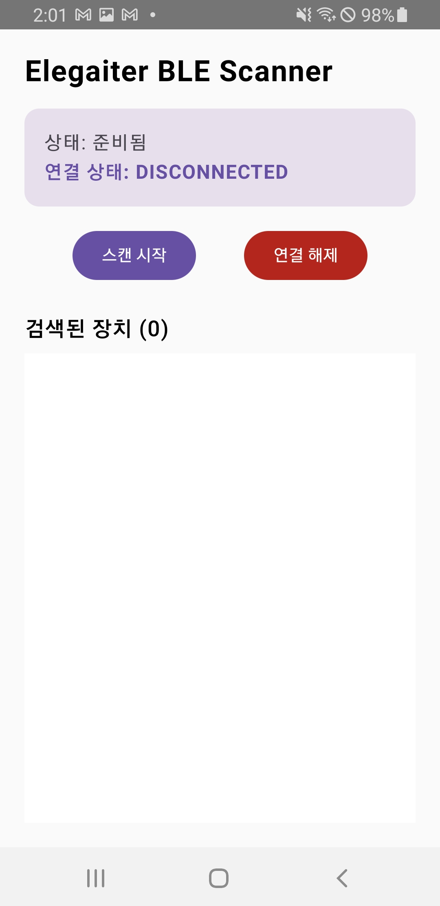
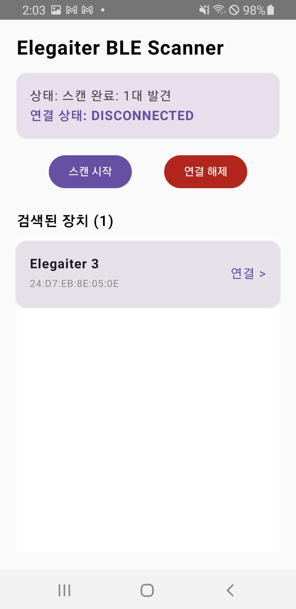
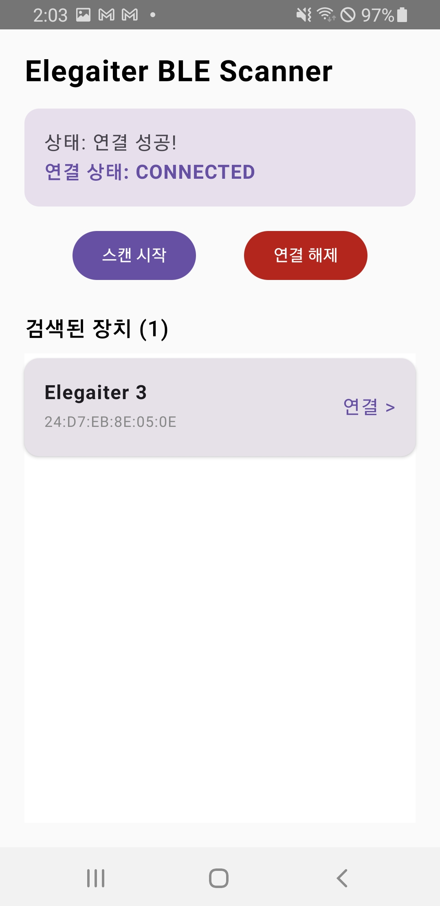
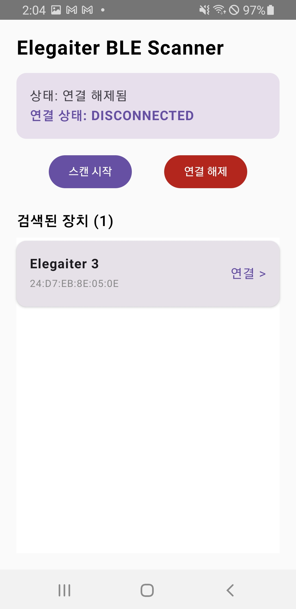

# 예제: BLE 기기 스캔 및 연결 (Jetpack Compose)

이 가이드에서는 **Jetpack Compose** 환경에서 Elegaiter SDK를 사용하여 주변 BLE 장치를 스캔하고, 목록에 표시한 뒤 원하는 장치에 연결 및 해제하는 전체 과정을 설명합니다.

> **사전 조건:** SDK 연동 가이드(README)의 0~5단계(저장소 설정, 의존성 추가, 권한 선언, 초기화)가 완료된 상태여야 합니다.

---

## 전체 구조

```
MyApplication.kt   → SDK 초기화 (앱 전역, 최초 1회)
AppState.kt        → 초기화 완료 여부 전역 상태 관리
MainViewModel.kt   → BLE 스캔/연결/해제 비즈니스 로직
MainActivity.kt    → 초기화 완료 전/후 화면 분기
BleScreen.kt       → 런타임 권한 요청 + 스캔 결과 목록 및 연결 UI (Compose)
```

---

## 1단계: 런타임 권한 요청

`AndroidManifest.xml`에 권한을 선언하는 것만으로는 부족합니다. BLE 스캔(`bleManager.scan()`) 호출 **이전**에 사용자에게 직접 권한을 요청해야 합니다.

> **📌 Manifest 권한 선언**은 연동 가이드(README) 4단계를 참고해 주세요. 이 단계에서는 런타임 요청 구현만 다룹니다.

Android 버전에 따라 요청해야 하는 권한이 다릅니다.

| Android 버전 | 필요한 런타임 권한 |
|---|---|
| Android 11 이하 (API ≤ 30) | `ACCESS_FINE_LOCATION` |
| Android 12 이상 (API ≥ 31) | `BLUETOOTH_SCAN`, `BLUETOOTH_CONNECT` |

런타임 권한 요청은 UI 레이어(Activity/Fragment/Composable)에서 처리합니다. 아래 3단계 UI 구현(`BleScreen.kt`)에 전체 코드가 포함되어 있습니다.

```kotlin
// BleScreen.kt 내 권한 요청 핵심 코드 미리보기
val requiredPermissions = if (Build.VERSION.SDK_INT >= Build.VERSION_CODES.S) {
    arrayOf(Manifest.permission.BLUETOOTH_SCAN, Manifest.permission.BLUETOOTH_CONNECT)
} else {
    arrayOf(Manifest.permission.ACCESS_FINE_LOCATION, Manifest.permission.ACCESS_COARSE_LOCATION)
}

val permissionLauncher = rememberLauncherForActivityResult(
    contract = ActivityResultContracts.RequestMultiplePermissions()
) { permissions ->
    val allGranted = permissions.values.all { it }
    if (allGranted) viewModel.startScan()
    else Toast.makeText(context, "BLE 기능을 사용하려면 권한이 필요합니다.", Toast.LENGTH_SHORT).show()
}
```

---

## 2단계: 전역 상태 및 SDK 초기화

### AppState.kt

SDK 초기화 완료 여부를 앱 전역에서 관찰할 수 있도록 `StateFlow`로 관리합니다. `MainActivity`에서 이 값을 구독하여 로딩 화면과 메인 화면을 전환합니다.

```kotlin
object AppState {
    val isSdkInitialized = MutableStateFlow(false)
}
```

---

### MyApplication.kt

앱 실행 시 단 한 번 SDK를 초기화합니다. 초기화 성공 시 `AppState.isSdkInitialized`를 `true`로 변경합니다.

> **AndroidManifest.xml 등록 필수:** 아래 클래스를 사용하려면 `<application>` 태그에 `android:name=".MyApplication"`을 반드시 추가해야 합니다.

```xml
<!-- AndroidManifest.xml -->
<application
    android:name=".MyApplication"
    ... >
```

```kotlin
// MyApplication.kt
class MyApplication : Application() {
    override fun onCreate() {
        super.onCreate()

        Elegaiter.init(this, "YOUR_API_KEY") { success, resultType, message ->
            if (success) {
                Log.d("ElegaiterSDK", "초기화 성공: $message")
                AppState.isSdkInitialized.value = true
            } else {
                // resultType으로 실패 원인 구분 가능 (NETWORK_ERROR, INVALID_LICENSE 등)
                Log.e("ElegaiterSDK", "초기화 실패 [$resultType]: $message")
            }
        }
    }
}
```

> **참고:** `init()`을 두 번 이상 호출해도 중복 초기화는 내부적으로 방지됩니다. 단, 초기화가 **진행 중**일 때 재호출하면 콜백이 호출되지 않고 무시되므로 주의하세요.

---

## 3단계: ViewModel 구현

UI와 SDK 사이를 연결하는 `MainViewModel`을 작성합니다. 스캔, 연결, 해제 기능과 UI에 노출할 상태를 관리합니다.

```kotlin
// MainViewModel.kt
import androidx.lifecycle.ViewModel
import androidx.lifecycle.viewModelScope
import com.elegaiter.sdk.Elegaiter
import com.elegaiter.sdk.model.Result
import com.elegaiter.sdk.model.ScannedDevice
import kotlinx.coroutines.flow.MutableStateFlow
import kotlinx.coroutines.flow.asStateFlow
import kotlinx.coroutines.launch

class MainViewModel : ViewModel() {

    // SDK 인스턴스 (초기화 완료 이후 접근 보장)
    private val sdk by lazy { Elegaiter.getInstance() }
    private val bleManager get() = sdk.bleManager

    // 스캔된 장치 목록
    private val _scannedDevices = MutableStateFlow<List<ScannedDevice>>(emptyList())
    val scannedDevices = _scannedDevices.asStateFlow()

    // 화면에 표시할 상태 메시지
    private val _statusMessage = MutableStateFlow("준비됨")
    val statusMessage = _statusMessage.asStateFlow()

    // BLE 연결 상태 (SDK StateFlow 직접 노출)
    val connectionState = bleManager.connectionState

    // -----------------------------------------------

    /** 주변 Elegaiter BLE 기기를 스캔합니다. */
    fun startScan() {
        viewModelScope.launch {
            _statusMessage.value = "스캔 중..."
            _scannedDevices.value = emptyList()

            when (val result = bleManager.scan()) {
                is Result.Success -> {
                    _scannedDevices.value = result.data
                    _statusMessage.value = if (result.data.isEmpty()) {
                        "주변에서 기기를 찾지 못했습니다."
                    } else {
                        "스캔 완료: ${result.data.size}대 발견"
                    }
                }
                is Result.Error -> {
                    _statusMessage.value = "스캔 실패: ${result.exception.message}"
                }
            }
        }
    }

    /** 선택한 기기에 BLE 연결을 시도합니다. */
    fun connectToDevice(device: ScannedDevice) {
        viewModelScope.launch {
            _statusMessage.value = "${device.name} 연결 시도 중..."

            when (val result = bleManager.connect(device)) {
                is Result.Success -> {
                    _statusMessage.value = "연결 성공!"
                }
                is Result.Error -> {
                    _statusMessage.value = "연결 실패: ${result.exception.message}"
                }
            }
        }
    }

    /** 현재 연결된 BLE 기기와의 연결을 해제합니다. */
    fun disconnect() {
        bleManager.disconnect()
        _statusMessage.value = "연결 해제됨"
    }
}
```

---

## 4단계: UI 구현 (Compose)

### MainActivity.kt

`AppState.isSdkInitialized`를 구독하여 SDK 초기화 전에는 로딩 화면을, 초기화 완료 후에는 메인 화면을 표시합니다.

> **⚠️ 주의:** `ViewModel` 생성 시점에 `Elegaiter.getInstance()`가 호출됩니다. 반드시 초기화 완료 이후에 `BleScreen()`이 Compose 트리에 진입하도록 분기하세요.

```kotlin
// MainActivity.kt
class MainActivity : ComponentActivity() {
    override fun onCreate(savedInstanceState: Bundle?) {
        super.onCreate(savedInstanceState)
        setContent {
            YourAppTheme {
                val isInitialized by AppState.isSdkInitialized.collectAsStateWithLifecycle()

                if (!isInitialized) {
                    // SDK 초기화 전: 로딩 화면
                    Box(
                        modifier = Modifier.fillMaxSize(),
                        contentAlignment = Alignment.Center
                    ) {
                        Column(horizontalAlignment = Alignment.CenterHorizontally) {
                            CircularProgressIndicator()
                            Spacer(modifier = Modifier.height(16.dp))
                            Text("SDK 초기화 중...")
                        }
                    }
                } else {
                    // SDK 초기화 완료: 메인 화면 진입
                    BleScreen()
                }
            }
        }
    }
}
```

---

### BleScreen.kt

스캔 결과 목록 표시, 권한 요청, 연결/해제 버튼을 포함한 메인 화면입니다.

```kotlin
// BleScreen.kt
@Composable
fun BleScreen(
    viewModel: MainViewModel = viewModel()
) {
    val context = LocalContext.current

    // Android 버전별 필요 권한 분기
    val requiredPermissions = if (Build.VERSION.SDK_INT >= Build.VERSION_CODES.S) {
        arrayOf(
            Manifest.permission.BLUETOOTH_SCAN,
            Manifest.permission.BLUETOOTH_CONNECT
        )
    } else {
        arrayOf(
            Manifest.permission.ACCESS_FINE_LOCATION,
            Manifest.permission.ACCESS_COARSE_LOCATION
        )
    }

    // 권한 요청 런처
    val permissionLauncher = rememberLauncherForActivityResult(
        contract = ActivityResultContracts.RequestMultiplePermissions()
    ) { permissions ->
        val allGranted = permissions.values.all { it }
        if (allGranted) {
            viewModel.startScan()
        } else {
            Toast.makeText(context, "BLE 기능을 사용하려면 권한이 필요합니다.", Toast.LENGTH_SHORT).show()
        }
    }

    // 권한 확인 후 스캔 시작하는 헬퍼 함수
    fun checkPermissionAndScan() {
        val allGranted = requiredPermissions.all {
            ContextCompat.checkSelfPermission(context, it) == PackageManager.PERMISSION_GRANTED
        }
        if (allGranted) viewModel.startScan()
        else permissionLauncher.launch(requiredPermissions)
    }

    // ViewModel 상태 구독
    val statusMessage by viewModel.statusMessage.collectAsStateWithLifecycle()
    val scannedDevices by viewModel.scannedDevices.collectAsStateWithLifecycle()
    val connectionState by viewModel.connectionState.collectAsStateWithLifecycle()

    Column(
        modifier = Modifier
            .fillMaxSize()
            .padding(horizontal = 20.dp, vertical = 16.dp)
    ) {

        // --- 상단: 타이틀 ---
        Text(
            text = "Elegaiter BLE Scanner",
            fontSize = 24.sp,
            fontWeight = FontWeight.Bold
        )
        Spacer(modifier = Modifier.height(16.dp))

        // --- 상태 카드 ---
        Card(
            modifier = Modifier.fillMaxWidth(),
            colors = CardDefaults.cardColors(
                containerColor = MaterialTheme.colorScheme.surfaceVariant
            )
        ) {
            Column(modifier = Modifier.padding(16.dp)) {
                Text(text = "상태: $statusMessage")
                Spacer(modifier = Modifier.height(4.dp))
                Text(
                    text = "연결 상태: $connectionState",
                    fontWeight = FontWeight.Bold,
                    color = when (connectionState) {
                        BleConnectionState.CONNECTED -> Color(0xFF2E7D32)     // 초록
                        BleConnectionState.CONNECTING -> Color(0xFFF57C00)    // 주황
                        BleConnectionState.ERROR -> Color(0xFFC62828)         // 빨강
                        else -> Color.Gray
                    }
                )
            }
        }

        Spacer(modifier = Modifier.height(16.dp))

        // --- 컨트롤 버튼 ---
        Row(
            modifier = Modifier.fillMaxWidth(),
            horizontalArrangement = Arrangement.spacedBy(12.dp)
        ) {
            Button(
                onClick = { checkPermissionAndScan() },
                modifier = Modifier.weight(1f)
            ) {
                Text("스캔 시작")
            }

            Button(
                onClick = { viewModel.disconnect() },
                modifier = Modifier.weight(1f),
                enabled = connectionState == BleConnectionState.CONNECTED,
                colors = ButtonDefaults.buttonColors(
                    containerColor = MaterialTheme.colorScheme.error
                )
            ) {
                Text("연결 해제")
            }
        }

        Spacer(modifier = Modifier.height(24.dp))

        // --- 스캔 결과 목록 ---
        Text(
            text = "검색된 기기 (${scannedDevices.size})",
            fontSize = 18.sp,
            fontWeight = FontWeight.SemiBold
        )
        Spacer(modifier = Modifier.height(8.dp))

        if (scannedDevices.isEmpty()) {
            Box(
                modifier = Modifier
                    .fillMaxWidth()
                    .padding(vertical = 32.dp),
                contentAlignment = Alignment.Center
            ) {
                Text(
                    text = "스캔 버튼을 눌러 주변 기기를 검색하세요.",
                    color = Color.Gray,
                    fontSize = 14.sp
                )
            }
        } else {
            LazyColumn(verticalArrangement = Arrangement.spacedBy(8.dp)) {
                items(scannedDevices) { device ->
                    DeviceListItem(
                        device = device,
                        isConnected = connectionState == BleConnectionState.CONNECTED,
                        onClick = { viewModel.connectToDevice(device) }
                    )
                }
            }
        }
    }
}

@Composable
fun DeviceListItem(
    device: ScannedDevice,
    isConnected: Boolean,
    onClick: () -> Unit
) {
    Card(
        modifier = Modifier
            .fillMaxWidth()
            .clickable(enabled = !isConnected, onClick = onClick),
        elevation = CardDefaults.cardElevation(defaultElevation = 2.dp)
    ) {
        Row(
            modifier = Modifier
                .padding(16.dp)
                .fillMaxWidth(),
            verticalAlignment = Alignment.CenterVertically,
            horizontalArrangement = Arrangement.SpaceBetween
        ) {
            Column {
                Text(
                    text = device.name.ifBlank { "(이름 없음)" },
                    fontWeight = FontWeight.Bold,
                    fontSize = 16.sp
                )
                Text(
                    text = device.address,
                    fontSize = 12.sp,
                    color = Color.Gray
                )
            }
            Text(
                text = if (isConnected) "연결됨" else "연결 >",
                color = if (isConnected) Color(0xFF2E7D32) else MaterialTheme.colorScheme.primary,
                fontSize = 14.sp
            )
        }
    }
}
```

---

## 5단계: 실행 결과 확인

### 1. 앱 최초 진입 시

- SDK 초기화가 완료될 때까지 로딩 화면이 표시됩니다.
- 초기화 완료 시 메인 화면으로 자동 전환됩니다.
- 상태: `준비됨` / 연결 상태: `DISCONNECTED`
- 기기 목록은 비어있는 안내 문구가 표시됩니다.

<p align="left">
  
</p>

### 2. 스캔 시작 버튼 클릭 시

- 최초 실행 시 BLE 권한 요청 팝업이 표시됩니다.
- 권한 허용 후 스캔이 시작되며 상태가 `스캔 중...`으로 변경됩니다.
- 스캔 완료 시 발견된 기기 목록이 하단에 표시됩니다.
- 주변에 기기가 없으면 `주변에서 기기를 찾지 못했습니다.` 안내가 표시됩니다.

<table>
  <tr>
    <td></td>
    <td></td>
  </tr>
</table>

### 3. 기기 항목 클릭 시 (연결)

- 상태: `[기기명] 연결 시도 중...` → `연결 성공!`
- 연결 상태: `CONNECTING` → `CONNECTED`로 변경됩니다.
- 연결 상태 텍스트 색상이 초록으로 변경됩니다.
- 연결 완료 후 목록 항목의 `연결 >` 텍스트가 `연결됨`으로 변경되며, 클릭이 비활성화됩니다.

<p align="left">
  
</p>


### 4. 연결 해제 버튼 클릭 시

- 상태: `연결 해제됨`
- 연결 상태: `DISCONNECTED`로 복귀합니다.
- 연결 해제 버튼은 `CONNECTED` 상태일 때만 활성화됩니다.

<p align="left">
  
</p>


---

## 주요 구현 포인트 정리

| 항목 | 설명 |
|------|------|
| **초기화 완료 후 ViewModel 접근** | `AppState.isSdkInitialized`가 `true`가 된 이후에 `BleScreen()`이 Compose 트리에 진입하도록 `MainActivity`에서 분기합니다. `getInstance()`가 초기화 전에 호출되면 예외가 발생합니다. |
| **Android 버전별 권한 분기** | API 31 이상은 `BLUETOOTH_SCAN` / `BLUETOOTH_CONNECT`, API 30 이하는 `ACCESS_FINE_LOCATION`이 필요합니다. |
| **연결 상태 색상 표시** | `BleConnectionState`에 따라 텍스트 색상을 다르게 적용하여 현재 연결 상태를 직관적으로 전달합니다. |
| **연결 중 중복 클릭 방지** | `DeviceListItem`의 `clickable`을 `isConnected` 상태에 따라 비활성화하여 이미 연결된 상태에서 다른 기기를 클릭하는 상황을 방지합니다. |
| **빈 목록 안내 처리** | 스캔 결과가 없을 때 빈 화면 대신 안내 문구를 표시하여 사용자 혼란을 줄입니다. |

---

## 다음 단계

BLE 연결이 완료된 이후 아래 기능으로 이어서 구현할 수 있습니다.

- **보행 분석 시작:** `GaitAnalysisManager.start()` → 실시간 보행 데이터 수집
- **사용자 로그인:** `AuthManager.login()` → 기록 저장을 위한 사용자 인증
- **운동 기록 저장:** `GaitRecordManager.recordAndSyncGait()` → 분석 결과 로컬 저장 및 서버 동기화

각 기능의 상세 사용법은 **[API 레퍼런스](./Guide_Android_API.md)** 문서를 참고하세요.
